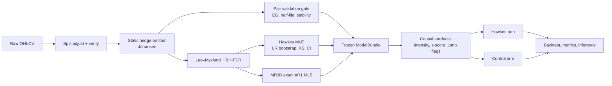
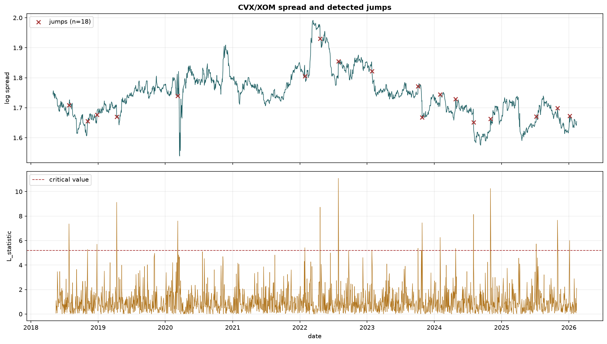
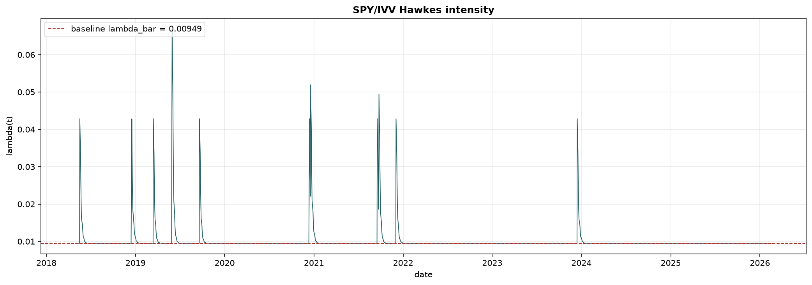

# Self-Exciting Jumps in Equity Pair Spreads: A Controlled Test of Hawkes-Driven Mean-Reverting Jump Diffusions for Statistical Arbitrage

> **Abstract.** We study whether the arrival of discontinuities ("jumps") in cointegrated equity pair spreads is *self-exciting*, and whether conditioning a mean-reversion strategy on the resulting jump intensity improves risk-adjusted performance. Each spread is modelled as a Mean-Reverting Jump Diffusion (MRJD) whose jump-counting process is a univariate Hawkes process with an exponential kernel. Jumps are dated with the Lee–Mykland (2008) per-observation test under Benjamini–Hochberg false-discovery control. The Hawkes process is estimated by exact maximum likelihood in an unconstrained reparameterisation, and self-excitation is tested against a homogeneous Poisson null with a parametric-bootstrap likelihood-ratio test, which handles the non-identification of the decay parameter under the null (the Davies problem). The trading layer maps the fitted intensity into volatility regimes that modulate entry thresholds, holding periods and position size. It is evaluated against a **matched control arm**: the identical strategy with the Hawkes layer removed. Evaluation uses a frozen-parameter train/validation split and a 23-quarter **continuous-book walk-forward** (July 2020 – February 2026) with in-loop threshold tuning, Newey–West inference on mean excess returns, autocorrelation-robust Sharpe standard errors, stationary-bootstrap intervals, the Deflated Sharpe Ratio, and explicit power analysis.
>
> **Findings.** (i) Once jumps are dated correctly and controlled for multiplicity, daily equity spreads yield only 0–13 jumps per pair over 4.7 training years. Self-excitation is not established on any pair: every branching-ratio 95% CI contains zero, and three of five pairs collapse to a Poisson process. (ii) The pairs rarely satisfy the strategy's own premises. Only 2 of 5 pass cointegration and half-life validation on the training window, and in walk-forward only 19 of 115 pair-quarters do, so the gated book is mostly in cash. (iii) The Hawkes arm does not outperform its control on any pair. A paired Newey–West test on daily return differences gives a pooled −0.23%/yr (*t* = −1.42) gated and −0.26%/yr (*t* = −0.67) when the gate is switched off. The Hawkes arm carries more exposure for a slightly lower return. (iv) Neither arm earns statistically significant excess return over cash out of sample. Ungated, SPY/IVV loses about 0.2%/yr with certainty (*t* ≈ −5) because its two-day spread cannot cover costs. (v) The design is underpowered. Detecting a 1%/yr edge on a single continuously traded pair would need well over a decade of daily data, so the nulls should be read as *"the design cannot resolve an edge of the size sought"*, not as proof that no edge exists. The main methodological finding is a catalogue of twenty failure modes that, left uncorrected, **manufacture** apparent self-excitation, spurious alpha or look-ahead. All were present in earlier versions of this study, and each is now covered by a regression test.

---

## Table of Contents

1. [Research Question and Hypotheses](#1-research-question-and-hypotheses)
2. [Intuition](#2-intuition)
3. [Contributions and Positioning](#3-contributions-and-positioning)
4. [Data](#4-data)
5. [Theoretical Framework](#5-theoretical-framework)
   - 5.1 [Spread construction and cointegration](#51-spread-construction-and-cointegration)
   - 5.2 [Mean-reverting jump diffusion](#52-mean-reverting-jump-diffusion-mrjd)
   - 5.3 [Jump detection](#53-jump-detection)
   - 5.4 [Hawkes process: estimation and inference](#54-hawkes-process-estimation-and-inference)
   - 5.5 [From intensity to trading decisions](#55-from-intensity-to-trading-decisions)
6. [Strategy and Execution Model](#6-strategy-and-execution-model)
7. [Experimental Design](#7-experimental-design)
8. [Statistical Evaluation](#8-statistical-evaluation)
9. [Results](#9-results)
10. [Discussion: Why There Is No Effect](#10-discussion-why-there-is-no-effect)
11. [Pitfalls, Limitations and Threats to Validity](#11-pitfalls-limitations-and-threats-to-validity)
12. [Implications and Future Work](#12-implications-and-future-work)
13. [Reproducibility](#13-reproducibility)
14. [Repository Structure](#14-repository-structure)
15. [References](#15-references)

---

## 1. Research Question and Hypotheses

> *Can a pairs-trading strategy that conditions on Hawkes-process jump intensity generate superior risk-adjusted returns relative to an otherwise identical mean-reversion strategy?*

The question splits into a **statistical** hypothesis about the data-generating process and an **economic** hypothesis about trading value. The economic claim only makes sense if the statistical one holds.

| | Null | Alternative | Test |
|---|---|---|---|
| **H1** (self-excitation) | Spread jump arrivals are homogeneous Poisson: $\alpha = 0$ | Hawkes with $\alpha > 0$, i.e. branching ratio $\eta = \alpha/\beta > 0$ | Likelihood ratio vs. Poisson with parametric-bootstrap null; Hessian CI on $\eta$; time-rescaling KS goodness-of-fit |
| **H2** (incremental value) | $\mathbb{E}[r^{\text{Hawkes}}_t - r^{\text{Control}}_t] = 0$ | Strictly positive | Paired Newey–West test on daily return differences; arm-by-arm comparison of Sharpe with HAC standard errors |
| **H3** (absolute value) | $\mathbb{E}[r_t - r_f] = 0$ for a dollar-neutral book | Strictly positive | Newey–West HAC *t*-test on daily excess returns; Deflated Sharpe Ratio for the threshold search |

H3 is reported for completeness. H2 is the question the project title asks: does the Hawkes layer add anything?

---

## 2. Intuition

A classical pairs trade bets that a stationary spread returns to its mean. The Ornstein–Uhlenbeck (OU) model behind it assumes continuous Gaussian innovations. Real spreads also contain **discontinuities**: earnings surprises, idiosyncratic news, index events, liquidity dislocations, ETF creation/redemption frictions. These jumps matter to a mean-reversion trader in three ways:

1. **They contaminate the signal.** A jump moves the z-score across an entry threshold without any "temporary mispricing" behind it. The spread has been displaced, not stretched.
2. **They contaminate the estimates.** Diffusion parameters fitted on a sample that contains jumps overstate $\sigma$ and understate mean-reversion speed.
3. **They may cluster.** If one jump raises the short-run probability of another, as is well documented for index returns and order flow, then entering a fade straight after a jump is "catching a falling knife". The better trade waits for the cascade to decay.

The Hawkes process is the canonical model for (3). Its conditional intensity $\lambda(t)$ rises by $\alpha$ at every event and decays at rate $\beta$. A fitted $\lambda(t)$ therefore gives a real-time, causal estimate of how "hot" the jump environment is. That leads to a natural trading hypothesis: **tighten or suspend entries when $\lambda(t)$ is elevated, relax them when it is at baseline, and size positions inversely to excess intensity**. The MRJD supplies the other half, a jump-robust estimate of mean-reversion speed and hence of the holding horizon.

The intuition is appealing, but it rests on an empirical premise: that there are enough jumps, and enough clustering among them, to estimate. Much of this study is about whether that premise holds at daily frequency.

---

## 3. Contributions and Positioning

Self-exciting jump processes are well established in finance (Hawkes 1971; Aït-Sahalia, Cacho-Diaz & Laeven 2015). Pairs trading is equally standard (Gatev, Goetzmann & Rouwenhorst 2006). The project does not claim a new model class. Its contributions are:

1. **A joint MRJD–Hawkes specification for equity pair spreads, evaluated as a controlled experiment.** Every result is reported for a *treatment* arm (Hawkes layer on) and a *control* arm (Hawkes layer off) that share data, folds, costs, execution, thresholds search and seed. That makes "does the Hawkes layer add value?" a measurable quantity rather than an anecdote.
2. **A correct event-dating pipeline for point-process estimation on spreads.** Jumps are dated per observation (Lee–Mykland), FDR-controlled, and placed on a trading-day clock before the Hawkes likelihood ever sees them. Section 11.1 shows that a common alternative, a rolling-window bipower test whose rejection is attributed to the window's last day, **mechanically fabricates** self-excitation.
3. **Valid inference for self-excitation.** The Hawkes MLE is reparameterised so that stationarity holds by construction and the optimum is interior. The LR test against Poisson uses a parametric-bootstrap null because the decay parameter is unidentified under $H_0$, so the usual $\chi^2$ reference is invalid. Goodness of fit uses the time-rescaling theorem.
4. **An evaluation protocol designed against the usual backtest pathologies:** frozen training bundles, a continuous (not restarted-and-stitched) walk-forward book, threshold tuning inside the walk-forward loop with the number of trials recorded for the Deflated Sharpe Ratio, idle-cash credit so that a flat book does not "underperform" by exactly $r_f$, next-open execution, gap-aware intraday stops, a pre-specified validation gate that blocks pairs failing cointegration or half-life checks, and sizing, stops and jump flags that use only information available at the time.
5. **Explicit power accounting.** Each null result comes with its standard error and minimum detectable effect, and a synthetic study (`intraday.py`) quantifies how many events the Hawkes layer actually needs.
6. **A documented audit trail** of fifteen methodological errors from an earlier version of this study, each with its quantitative consequence and its fix (Section 11.1). For practitioners this is arguably the most transferable output.

---

## 4. Data

| Item | Detail |
|---|---|
| Source | Databento raw daily OHLCV bars (`ts_event`, open, high, low, close, volume); **unadjusted** |
| Universe | 10 US-listed symbols: AMD, CVX, GDX, GLD, GS, IVV, MS, NVDA, SPY, XOM |
| Span | 2018-05-01 → 2026-02-12/19 (1,959–1,963 bars per symbol) |
| Corporate actions | NVDA 4:1 (2021-07-20) and 10:1 (2024-06-10) splits back-adjusted from a hard-coded table. Each factor is **re-derived from the raw price jump and asserted** (`corporate_actions.verify_split_table`). Every other symbol is scanned and verified to have no single-day move above 40%. |
| Dividends | **Excluded** from both spread and P&L (disclosed; see Section 11.3). Indicative annual differentials: CVX/XOM ≈ 0.9%, GS/MS ≈ 0.8%, GLD/GDX ≈ 1.3%, SPY/IVV ≈ 0, AMD/NVDA ≈ 0. |
| Benchmark | SPY *price* series, used only for a market-neutrality regression |
| Cleaning | Inner join on common dates and drop missing rows. Large moves are **flagged, never deleted**: deleting them would remove the very phenomenon under study and leave irregular gaps in a clock that both the Hawkes compensator and the OU transition density assume is regular. |

**Registered pairs**, each with an ex-ante economic rationale:

| Segment | Pair (A/B) | Economic link | Role |
|---|---|---|---|
| ETF | SPY/IVV | Two S&P 500 trackers | Near-arbitrage control: maximal cointegration, minimal edge |
| Energy | CVX/XOM | Integrated oil majors | Common commodity factor |
| Financials | GS/MS | Investment banks | Common capital-markets factor |
| Semiconductors | AMD/NVDA | Sector peers | Linked but exposed to a structural break (AI cycle) |
| Gold | GLD/GDX | Bullion vs. miners | Related but levered/operationally distinct |

---

## 5. Theoretical Framework

### 5.1 Spread construction and cointegration

For prices $P^A_t, P^B_t$ the log-spread is

```math
S_t \;=\; \log P^A_t \;-\; h\,\log P^B_t ,
```

with hedge ratio $h$ estimated **once on the training window and then frozen** (`hedge_mode="static"`). In walk-forward it is re-estimated at each quarter boundary and held fixed within the quarter. The default estimator is the **Johansen** cointegrating vector $(v_A, v_B)$ from a VECM with one lagged difference and an unrestricted constant, normalised on leg A, so $h = -v_B/v_A$; the trace statistic and its critical values are recorded. OLS of $\log P^A$ on $\log P^B$, the inverted reverse regression and total least squares are reported alongside, so the sensitivity to the estimator is visible. They differ materially on AMD/NVDA (Johansen 0.73 vs. OLS 0.91) and GLD/GDX (0.82 vs. 0.62).

*Why not a rolling hedge ratio?* If $h_t$ varies, then

```math
\Delta S_t \;=\; \Delta\log P^A_t \;-\; h_t\,\Delta\log P^B_t \;-\; \Delta h_t\,\log P^B_{t-1}.
```

With a 30-day rolling OLS, the third term, an estimation artefact multiplied by a *price level*, accounted for 99.2–99.8% of $\mathbb{E}|\Delta S_t|$ across all five pairs and inflated spread volatility by 4.8× to 81.9×. A daily-moving hedge is also not a position anyone can hold. The rolling mode survives only as a labelled robustness option.

**Stationarity testing.** $S_t$ is a residual from an *estimated* cointegrating vector, so a standard ADF test, whose Dickey–Fuller critical values assume an observed series, over-rejects. Stationarity is therefore judged with the **Engle–Granger** test using Phillips–Ouliaris residual-based critical values. The naive ADF *p*-value is reported alongside so the size of the over-rejection is visible.

**Pair validation.** Five checks are computed on the training window: EG stationarity ($p<0.05$); AR(1) half-life in $[5, 120]$ trading days; rolling-mean stability ($\mathrm{sd}(\bar S^{(252)}_t)/\mathrm{sd}(S_t) < 0.5$); range below $10\,\mathrm{sd}$; and a recent-vs-full-sample mean shift below $1\,\mathrm{sd}$. All five feed `is_tradeable`, and **a pair that fails any of them opens no positions** in either arm (`TradingConfig.require_tradeable`). In walk-forward the gate is re-evaluated at every quarterly refit. A position carried into a quarter that fails is closed at that quarter's first bar. `--ignore-validation` disables the gate and reproduces the ungated behaviour.

### 5.2 Mean-reverting jump diffusion (MRJD)

```math
dS_t \;=\; \kappa(\theta - S_t)\,dt \;+\; \sigma\,dW_t \;+\; Y\,dN_t,
\qquad Y \sim \mathcal N(\mu_J,\sigma_J^2),
\qquad N_t \sim \text{Hawkes}(\bar\lambda,\alpha,\beta).
```

**Time unit.** Everything is measured in **trading days**, with $\Delta t = 1$. Using $\Delta t = 1/252$ turns $\kappa$ into a per-year rate while half-lives and holding periods are read in days, a factor-of-252 error that an earlier version of the code had. `time_units.assert_trading_day_units` now makes any reintroduction fail loudly.

**Estimation by exact discretisation.** Between jumps the OU transition is exactly Gaussian:

```math
S_{t+1}\mid S_t \;\sim\; \mathcal N\!\Big(\theta + (S_t-\theta)\,\phi,\;\; s^2(1-\phi^2)\Big),
\qquad \phi = e^{-\kappa\Delta t},\quad s^2 = \frac{\sigma^2}{2\kappa}.
```

This is an AR(1) regression $S_{t+1} = c + \phi S_t + \varepsilon_t$, so the conditional MLE is closed-form OLS. It has no flat likelihood direction and no optimiser that can fail. Parameters are recovered by inversion:

```math
\kappa = -\frac{\ln\phi}{\Delta t},\qquad
\theta = \frac{c}{1-\phi},\qquad
\sigma = s\sqrt{2\kappa},\qquad
t_{1/2} = \frac{\ln 2}{\kappa},\qquad
\mathrm{sd}_\infty(S) = \frac{\sigma}{\sqrt{2\kappa}} .
```

Transitions that *end* on a detected jump are excluded, so $(\kappa,\theta,\sigma)$ describe the continuous component. $(\mu_J,\sigma_J)$ are the sample moments of $\Delta S_t$ on jump days. The estimator raises `MRJDFitError` if $\phi \le 0$ (not mean-reverting) or $\phi \ge 1$ (unit root).

Why reparameterise? A 50-day half-life implies $\phi \approx 0.986$, close to a unit root, where the likelihood in $(\kappa,\sigma)$ is nearly flat. Direct numerical optimisation in the earlier version produced an implied stationary s.d. 15.6× the empirical one (GS/MS), and AMD/NVDA pinned $\sigma$ at its upper bound. An optional joint MLE over $(\phi,\theta,s,\mu_J,\sigma_J)$, using a Gaussian mixture on jump days, is available (`MRJDConfig.joint_refinement`). The model's half-life is compared against the empirical one and reported, **never silently overwritten**.

The MRJD feeds the strategy through the half-life (which sets the holding period) and optionally through a parametric z-score $(S_t-\theta)/\mathrm{sd}_\infty$ and an expected reversion time $t = \ln(z_0/z_1)/\kappa$.

### 5.3 Jump detection

**Primary: Lee–Mykland (2008).** Each daily spread change $r_i = \Delta S_i$ is standardised by a local bipower volatility computed from a **strictly preceding** window of $K = 20$ days:

```math
\mathcal L_i = \frac{|r_i|}{\hat\sigma_i},\qquad
\hat\sigma_i^2 = \frac{1}{K-2}\sum_{j=i-K+2}^{i-1} |r_j|\,|r_{j-1}| .
```

Under the no-jump null the normalised maximum converges to a Gumbel law:

```math
\frac{\max_i \mathcal L_i - C_n}{S_n} \xrightarrow{d} \xi,\quad P(\xi\le x)=e^{-e^{-x}},\qquad
C_n = \frac{\sqrt{2\log n}}{c} - \frac{\log\pi + \log\log n}{2c\sqrt{2\log n}},\quad
S_n = \frac{1}{c\sqrt{2\log n}},\quad c=\sqrt{2/\pi}.
```

This gives a per-observation *p*-value $p_i = 1-\exp\{-e^{-(\mathcal L_i - C_n)/S_n}\}$. A rejection at $i$ means *"a jump occurred at $i$"*, which is exactly the event time a point-process likelihood requires.

**Multiplicity.** Roughly 1,950 tests at a nominal 5% would produce about 98 false positives. Jump flags are therefore Benjamini–Hochberg FDR-controlled at 5% by default ("FDR basis"). When FDR leaves fewer than 10 events, the Hawkes layer is fitted on the Gumbel-critical-value rule ("nominal basis"). This fallback is recorded in every artefact and never applied silently.

**Causality out of sample.** Two parts of the test depend on the whole sample: the normalisers $C_n, S_n$ (through $n$) and the BH cutoff (through every *p*-value). Both are therefore **frozen on the training window**. $n$ is fixed at the training length, and on the FDR basis day $t$ is flagged iff $p_t \le p^\ast$, where $p^\ast$ is the largest *p*-value BH rejected in training (or $\alpha/m$ if it rejected none). This reproduces the training flags exactly, and every later flag depends only on data up to $t$. Re-running BH over the full sample, as an earlier version did, lets later *p*-values decide whether an earlier day counts as a jump.

**Robustness: Barndorff-Nielsen–Shephard bipower test**, in log-ratio form:

```math
Z = \frac{\log RV - \log BV}{\sqrt{\frac{\vartheta}{m}\max\!\big(1, TP/BV^2\big)}},\qquad \vartheta = \tfrac{\pi^2}{4}+\pi-5 \approx 0.609 .
```

BNS asymptotics require $\Delta\to 0$, meaning many *intraday* returns per tested period. On daily bars there is no asymptotic regime in which the test is valid, so it serves only as a robustness check (`intraday.Frequency.bipower_is_valid`). Because a rejection means "a jump somewhere in the trailing window", the flag is attributed to the largest $|r|$ inside that window. A naive $4\sigma$ threshold rule is kept for the detector comparison.

### 5.4 Hawkes process: estimation and inference

**Model.** On the trading-day clock, with event times $t_1<\dots<t_n$ in $[0,T]$:

```math
\lambda(t) \;=\; \bar\lambda \;+\; \sum_{t_i < t} \alpha\, e^{-\beta (t-t_i)} .
```

The **branching ratio** $\eta = \alpha/\beta$ is the expected number of direct "offspring" per event. In the cluster representation, each exogenous event spawns a cascade of expected total size $1/(1-\eta)$. The process is stationary iff $\eta<1$, with long-run mean intensity $\bar\lambda/(1-\eta)$. A value $\eta = 0$ is the homogeneous Poisson process.

**Exact log-likelihood** with the standard $O(n)$ recursion:

```math
\ell(\bar\lambda,\alpha,\beta) = \sum_{i=1}^n \log\!\big(\bar\lambda + \alpha R_i\big) \;-\; \bar\lambda T \;-\; \frac{\alpha}{\beta}\sum_{i=1}^n\big(1-e^{-\beta(T-t_i)}\big),
\qquad R_i = e^{-\beta(t_i-t_{i-1})}(1+R_{i-1}),\; R_1 = 0 .
```

**Unconstrained reparameterisation.** The model is fitted in $u\in\mathbb R^3$ with

```math
\bar\lambda = e^{u_0},\qquad \beta = e^{u_1},\qquad \eta = \mathrm{logistic}(u_2),\qquad \alpha = \eta\beta ,
```

so $0<\eta<1$ holds *by construction*, the objective is smooth everywhere, and L-BFGS-B is run from four starting points. This replaces a penalty that returned the constant $10^{10}$ whenever $\eta > 0.85$. Finite-difference gradients see that as a cliff, and in the earlier version every reported branching ratio landed within 2% of the 0.85 wall, where standard errors are meaningless.

**Inference.**

| Quantity | Method |
|---|---|
| $\mathrm{se}(\bar\lambda,\alpha,\beta)$ | Inverse of the numerical Hessian of $-\ell$ in natural parameters |
| CI on $\eta$ | Delta method: $\nabla\eta = (1/\beta,\, -\alpha/\beta^2)$ |
| $H_0: \alpha = 0$ | $LR = 2(\ell_{\text{Hawkes}} - \ell_{\text{Poisson}})$, with $\ell_{\text{Poisson}} = n\log(n/T) - n$. Under $H_0$ the decay $\beta$ is **unidentified** (the Davies problem), so $LR \not\sim \chi^2$. The $\chi^2_2$ *p*-value is reported only as a reference; the quoted *p*-value comes from a **parametric bootstrap** (200 Poisson replications refitted with the full Hawkes MLE). |
| Goodness of fit | Time-rescaling theorem: $\tau_i = \Lambda(t_i) - \Lambda(t_{i-1}) \overset{iid}{\sim}\text{Exp}(1)$ under correct specification. Tested by KS and visualised by QQ plot. |
| Intensity calibration | Poisson GLM of next-day jump indicator on $\log\hat\lambda(t)$. A well-calibrated intensity has slope ≈ 1. |
| Estimator validity | Synthetic recovery via Ogata thinning in the test suite: known parameters recovered, LR rejects on clustered data and does not reject on Poisson data, CI covers truth. |

The intensity used for trading, `compute_intensity_at_times`, sums only over events **strictly before** each evaluation time, so it is causal.

### 5.5 From intensity to trading decisions

**Regimes on relative excess intensity.** Since $\lambda(t)\ge\bar\lambda$ always, percentile bucketing of a spike train is degenerate: the lower quantiles pile onto an atom at $\bar\lambda$, and in an earlier version "calm" was unreachable on two pairs. Regimes are therefore cut on

```math
e_t = \frac{\lambda(t)-\bar\lambda}{\bar\lambda},
```

where $\bar\lambda$ is frozen from the training bundle:

| Regime | Rule | Entry threshold | Exit threshold | Max hold | Size factor |
|---|---|---|---|---|---|
| CALM | $e_t < 0.05$ | $0.85\,z_{\text{in}}$ | $0.85\,z_{\text{out}}$ | $1.2\times$ | 1.2 |
| NORMAL | $0.05 \le e_t < 1$ | $z_{\text{in}}$ | $z_{\text{out}}$ | $1.0\times$ | 1.0 |
| ELEVATED | $1 \le e_t < 5$ | $1.25\,z_{\text{in}}$ | $1.2\,z_{\text{out}}$ | $0.75\times$ | 0.7 |
| CRISIS | $e_t \ge 5$ | $1.5\,z_{\text{in}}$, **entries blocked** | $1.3\,z_{\text{out}}$ | $0.5\times$ | 0.5 |

**Cascade-decay gate.** If $e_t \ge 0.05$, an entry also requires $\lambda(t)$ to have fallen at least 15% from its 5-day peak ("wait for the cascade to subside"). When no cascade is in progress the gate is open; otherwise a flat intensity would block every trade.

**Jump-assisted entries.** On a detected jump day the entry threshold is relaxed to $0.65\times$ the regime threshold and the position is sized down by 20%. These entries pass through the same CRISIS and decay gates.

**Position sizing.**

```math
w_t = \mathrm{clip}\Big(0.25 \cdot \min\!\big(\tfrac{|z_t|}{3},\,1.5\big)\cdot f_\lambda \cdot f_{\text{regime}},\;0.10,\;0.25\Big),
\qquad f_\lambda = \mathrm{clip}\big(1.5 - e_t,\;0.5,\;1.5\big).
```

**Control arm** (`Config.as_control_arm`): `use_hawkes_regimes=False`, `use_jump_entries=False`. Every observation is NORMAL, $f_\lambda = 1$, and there is no decay gate and no jump entries. Everything else is identical.

---

## 6. Strategy and Execution Model

**Signal.** The default is an empirical z-score with a 60-day *strictly lagged* window, $z_t = (S_t - \bar S_{t-60:t-1})/\mathrm{sd}(S_{t-60:t-1})$, so the current bar never enters its own normalisation. Long the spread when $z_t < -z_{\text{in}}$, short when $z_t > z_{\text{in}}$ (base $z_{\text{in}}=2.0$, $z_{\text{out}}=0.5$, tuned in walk-forward).

**Exits.** All conditions are evaluated **independently** each bar and resolved by a fixed priority. An earlier `elif` chain made three of the five exits unreachable, which every committed trade log confirmed.

| Priority | Exit | Condition |
|---|---|---|
| 1 | `emergency_stop` | $z$ moves 2.5 against the entry level |
| 2 | `regime_crisis` | Regime escalates to CRISIS after a non-CRISIS entry |
| 3 | `max_hold` | Holding period ≥ regime-adjusted maximum |
| 4 | `profit_target` | $z$ crosses through the mean past $z_{\text{out}}$ (after min hold) |
| 5 | `mean_reversion` | $\lvert z\rvert < z_{\text{out}}$ (after min hold) |

Holding periods scale with the training half-life: minimum $0.5\,t_{1/2}$, maximum $1.5\,t_{1/2}$ (capped at 120 days, and scaled by the regime multiplier in the Hawkes arm).

**Backtest engine** (`backtest_engine.py`), event-driven on daily bars:

| Component | Implementation |
|---|---|
| Sizing | Leg A gets $w\cdot\text{cash}/(1+\lvert h\rvert)$ dollars and leg B gets $h$ times that, opposite sign, so the book tracks $\log A - h\log B$. Gross notional is ≈ $w\cdot$cash. In walk-forward, $h$ is the hedge ratio frozen for the quarter in which the position is *entered*. |
| Execution | Signals on bar $t$, fills at the **open of $t+1$** (`execution_delay=1`) |
| Costs | Commission 2 bp + slippage 1 bp per side on gross notional, at entry and exit (6 bp round trip) |
| Financing | Long financing 2%/yr, short rebate 1.5%/yr, per-symbol borrow 20–100 bp/yr, accrued daily |
| Idle cash | Credited at $r_f = 2\%$ on the undeployed share of equity. Without this a dollar-neutral book that is flat about 90% of the time shows a CAPM "alpha" of almost exactly $-r_f$, which is what the earlier version reported. |
| Stops | Volatility-scaled backstops in units of the spread's stationary s.d.: hard stop $4\,\mathrm{sd}$, profit target $5\,\mathrm{sd}$, trailing stop activated at $1.5\,\mathrm{sd}$. All are clamped to $[1\%, 50\%]$ of notional. The s.d. is the **training-window** spread s.d. from the frozen bundle, and each position keeps the levels set at its entry. Measuring it on the window being traded would size stops with knowledge of that window's realised volatility. Fixed 3% stops structurally conflict with mean reversion: in an earlier run they caused 85–100% of trades to exit via stop at 1.7–12 days (see Section 11.2(b)). |
| Stop fills | Checked against the intraday High/Low. If the open already gaps through the level, the fill is at the open. |
| End of sample | Open positions are force-closed and **recorded** |
| Integrity | Raises if equity ≤ 0. The earlier `max(equity, 1)` denominator floor has been removed. |

---

## 7. Experimental Design



**7.1 Train / validation.** Train 2018-05-01 → 2022-12-31 (1,177 obs); validation 2023-01-01 → 2024-12-31 (≈ 502 obs). The hedge ratio, pair validation, jump detection, Hawkes and MRJD parameters and $\bar\lambda$ are fitted on train only, frozen into a `ModelBundle`, and applied unchanged to validation.

**7.2 Walk-forward (headline).** After a minimum of 504 training observations, at each calendar quarter-end the procedure:

1. Re-estimates the hedge ratio on all data to date.
2. Refits the full bundle, including the validation gate and the frozen jump-detection cutoff.
3. If the pair passes validation, grid-searches $z_{\text{in}}\in\{1.5,2.0,2.5\}\times z_{\text{out}}\in\{0.25,0.5,0.75\}$ **on the training window only**, maximising Sharpe.
4. Generates signals for the next quarter with frozen parameters. Each bar carries its quarter's hedge ratio and training spread s.d., so every position is sized and stopped with information available at entry.

This yields 23 quarters (2020-07-01 → Feb 2026, about 1,414 trading days). Up to 9 configurations are tried per *tradeable* quarter, and the total feeds the Deflated Sharpe Ratio.

The book is **one continuous backtest**: parameters are swapped at quarter boundaries while cash and open positions carry through. The earlier engine restarted each quarter with fresh capital, silently liquidated trades that had not reached their minimum hold, and stitched the curves in a way that zeroed 23 genuine daily returns. It also wrote all-zero trade statistics that looked like measurements. Failed quarters are logged rather than dropped; there were 0 failures in the published runs.

**7.3 Robustness matrix** (pre-specified, one factor at a time; published for CVX/XOM): half and double costs; fixed thresholds (1.5/0.5 and 2.5/0.5, no tuning); bipower detector; static OLS hedge. Separately, an **ungated sensitivity** reruns the walk-forward for every pair with the validation gate switched off (Section 9.6).

**7.4 Cross-pair portfolio.** An equal-weight portfolio of the five walk-forward return streams, per arm, reports effective breadth $N_{\text{eff}} = N/(1+(N-1)\bar\rho)$.

**7.5 Cross-sectional screen** (`pair_screen.py`). All $\binom{10}{2}=45$ pairs are screened on training data against criteria fixed in advance: EG $p<0.05$, half-life in $[5,120]$, predictive $t\le -1.5$ at 20 days, edge ≥ 5× cost, $0<h<5$. Results are reported with BH and Bonferroni corrections across the 45 tests.

**7.6 Diagnostics** (`diagnostics.py`): a theoretical Sharpe ceiling, z-score predictability regressions, and a stop sensitivity analysis.

**7.7 Synthetic power study** (`intraday.py`): how many events are needed to detect a known $\eta=0.5$?

---

## 8. Statistical Evaluation

| Statistic | Definition and rationale |
|---|---|
| **Headline test** | $H_0: \mathbb{E}[r_t - r_f]=0$ with a Newey–West (Bartlett) long-run variance, lag $\lfloor 4(n/100)^{2/9}\rfloor$. For a dollar-neutral book $\beta\approx 0$ by construction, so a CAPM intercept mostly measures cash accounting. The CAPM regression vs. SPY (HAC, 5 lags) is reported **only to demonstrate neutrality**. |
| Sharpe SE | Lo's approximation: $\mathrm{se}(\widehat{SR}) \approx \sqrt{(1+\widehat{SR}^2/2)/n}$ per period, inflated by $\sqrt{\widehat{LRV}/\hat\sigma^2}$ to account for serial dependence from multi-week holding |
| Bootstrap CIs | Politis–Romano stationary bootstrap, mean block 20 days, 1,000 replications, for Sharpe, mean return and max drawdown |
| Deflated Sharpe | Bailey & López de Prado (2014), with expected maximum Sharpe under no skill after $N$ trials $E[\max SR] \approx \sqrt{V}\big[(1-\gamma)\Phi^{-1}(1-\tfrac1N) + \gamma\Phi^{-1}(1-\tfrac1{Ne})\big]$ |
| Power / MDE | $\text{MDE}_{80\%} = (z_{0.975}+z_{0.80})\,\sigma_{\text{ann}}/\sqrt{\text{years}}$; achieved power against a 1%/yr target |
| Capital-at-risk view | *Excess* return scaled by $1/\overline{\text{gross exposure}}$; the risk-free credit is not levered |
| Paired arm test (H2) | NW *t*-test on $r^{\text{Hawkes}}_t - r^{\text{Control}}_t$, computed from the published equity curves (Section 9.5) |

---

## 9. Results

All figures are read from the artefacts in `outputs/` produced by the current code (seed 42). The authoritative files are those listed in each directory's `MANIFEST.json` (see Section 13). Returns are annualised percentages unless stated otherwise. The **primary specification is gated**: a pair or quarter that fails validation does not trade. The ungated sensitivity (`--ignore-validation`) is reported separately in Section 9.6.

### 9.1 Spread properties and pair validation (training window, 1,177 obs)

| Pair | $h$ (Johansen) | Johansen trace (95% cv 15.49) | EG *p* | ADF *p* | AR(1) $t_{1/2}$ (d) | Mean drift | Mean shift (sd) | Range (sd) | Tradeable | Failing checks |
|---|---:|---:|---:|---:|---:|---:|---:|---:|:---:|---|
| SPY/IVV | 1.004 | **134.6** | **0.009** | 0.002 | **1.9** | 0.44 | 0.19 | 8.96 | ✗ | half-life < 5 d |
| CVX/XOM | 0.710 | 8.3 | 0.266 | 0.108 | 49.4 | 0.63 | 1.24 | 6.22 | ✗ | EG, stable mean, regime shift |
| GS/MS | 0.795 | 10.8 | **0.042** | 0.011 | 46.3 | 0.48 | 0.45 | 4.41 | ✓ | — |
| AMD/NVDA | 0.732 | **19.9** | **0.016** | 0.001 | 71.8 | 0.47 | 0.21 | 5.23 | ✓ | — |
| GLD/GDX | 0.821 | 10.1 | 0.671 | 0.123 | 41.8 | 0.50 | 1.04 | 5.77 | ✗ | EG, stable mean, regime shift |

The ADF–EG gap is substantial (0.108 vs. 0.266 on CVX/XOM), which confirms that naive ADF over-states cointegration. The Johansen trace test rejects "no cointegration" only for SPY/IVV and AMD/NVDA; GS/MS passes EG at 4.2% but not Johansen. **Only two of the five registered pairs pass validation on the 2018–2022 window, so only those two trade in the train/validation experiment.** SPY/IVV is strongly cointegrated but reverts with a ~2-day half-life, too fast for the strategy's holding rules.

### 9.2 MRJD estimates (training)

| Pair | $\kappa$ (1/day) | Model $t_{1/2}$ | $\sigma$ | $\mathrm{sd}_\infty$ implied / actual | $\mu_J$ | $\sigma_J$ | $\lvert t^{\text{model}}_{1/2}/t^{\text{emp}}_{1/2}-1\rvert$ |
|---|---:|---:|---:|---:|---:|---:|---:|
| SPY/IVV | 0.4114 | 1.7 | 0.0015 | 0.94 | −0.0012 | 0.0061 | 11% |
| CVX/XOM | 0.0106 | 65.6 | 0.0119 | 1.12 | −0.0041 | 0.0488 | 33% |
| GS/MS | 0.0133 | 52.2 | 0.0092 | 1.00 | −0.0039 | 0.0448 | 13% |
| AMD/NVDA | 0.0098 | 70.6 | 0.0230 | 0.54 | +0.0063 | 0.1157 | 2% |
| GLD/GDX | 0.0118 | 58.7 | 0.0132 | 1.13 | −0.0068 | 0.0923 | 40% |

The reparameterised fit reproduces the empirical dispersion within roughly 0.5–1.1× on every pair, whereas the earlier direct optimisation was off by up to 15.6×. The half-life disagreements on CVX/XOM and GLD/GDX are consistent with those pairs failing the EG test: on a near-unit-root series, $\kappa$ is poorly identified.

### 9.3 Jump detection and the self-excitation test (H1)

| Pair | Jumps FDR / nominal | Basis | $\hat{\bar\lambda}$ | $\hat\alpha$ | $\hat\beta$ | $\hat\eta$ | 95% CI on $\eta$ | LR | $p_{\chi^2_2}$ | $p_{\text{boot}}$ (eff. reps) | KS *p* |
|---|---:|---|---:|---:|---:|---:|---|---:|---:|---:|---:|
| SPY/IVV | 13 / 25 | FDR | 0.0095 | 0.046 | 0.324 | 0.142 | [−0.123, 0.407] | 2.08 | 0.353 | 0.086 (198) | 0.85 |
| CVX/XOM | 5 / 8 | nominal | 0.0068 | ≈0 | 0.500 | ≈0 | [−0.002, 0.002] | ≈0 | 1.000 | 0.717 (180) | 0.21 |
| GS/MS | 0 / 7 | nominal | 0.0060 | ≈0 | 0.500 | ≈0 | [−0.001, 0.001] | ≈0 | 1.000 | 0.643 (171) | 0.78 |
| AMD/NVDA | 3 / 9 | nominal | 0.0077 | ≈0 | 0.500 | ≈0 | [−0.001, 0.001] | ≈0 | 1.000 | 0.690 (187) | 0.14 |
| GLD/GDX | 0 / 5 | nominal | 0.0028 | 0.053 | 0.150 | 0.351 | [−0.205, 0.907] | 4.81 | 0.090 | 0.008 (122) | 0.50 |

<p align="center">
  <br>
  <em>Figure 1. CVX/XOM: Lee–Mykland statistic vs. the training-frozen Gumbel critical value. Rejections are sparse and isolated; there are no visible bursts.</em>
</p>

**Verdict on H1: not supported.**

- Four of five pairs need the nominal fallback because FDR leaves 0–5 events. With so few events, three of the fits converge to the Poisson boundary $\alpha \to 0$.
- On those three pairs $\hat\beta = 0.500$ is exactly the optimiser's starting value. This is the Davies problem in action: once $\alpha=0$, $\beta$ has no influence on the likelihood and is not estimated at all.
- SPY/IVV, the only pair with a well-populated FDR basis, shows modest point estimates ($\eta = 0.14$), but neither the bootstrap LR ($p=0.086$) nor the CI rejects Poisson.
- GLD/GDX's bootstrap $p = 0.008$ rests on **five events** and only 122 usable bootstrap replications. The $\chi^2$ reference gives $p=0.09$ and the $\eta$ CI spans [−0.21, 0.91]. This is not credible evidence of excitation.
- Across the 23 walk-forward refits, the LR test rejects at 5% in 9/23 quarters for SPY/IVV, 8/23 for GLD/GDX, 1/23 for GS/MS and 0/23 for CVX/XOM and AMD/NVDA. Without correction across 23 refits this is weak and unstable evidence.
- On the α≈0 pairs the intensity-calibration GLM is degenerate (slopes of order $-10^5$), because there is no variation in $\hat\lambda(t)$ to calibrate.

<p align="center">
  <br>
  <em>Figure 2. SPY/IVV: the most active intensity in the study. Ten isolated spikes over eight years, each decaying to baseline within about a week.</em>
</p>

A direct consequence is that **the Hawkes arm is almost always in the CALM regime**. In validation it occupies CALM on 97% (SPY/IVV), 99.8% (CVX/XOM, GS/MS, AMD/NVDA) and 84% (GLD/GDX) of days, and on 77–94% of walk-forward days. In validation the CRISIS block and the decay gate never bind, and the jump-entry path fires once (GS/MS).

### 9.4 Train / validation, both arms

SPY/IVV, CVX/XOM and GLD/GDX fail validation on the training window, so **neither arm opens a position** in train or validation. Their books earn the credited risk-free rate exactly (2.02% compounded, excess return 0, Sharpe 0). The two tradeable pairs:

| Pair | Window | Arm | Trades | Gross exp. | Ann. ret | Ann. vol | Sharpe (HAC se) | Max DD | NW excess %/yr | NW *t* | *p* |
|---|---|---|---:|---:|---:|---:|---:|---:|---:|---:|---:|
| GS/MS | Train | Hawkes | 21 | 14.9% | 1.47 | 1.78 | −0.30 (0.45) | −2.58 | −0.53 | −0.65 | 0.514 |
| | | Control | 21 | 11.2% | 2.01 | 1.34 | −0.00 (0.46) | −1.69 | −0.00 | −0.00 | 0.997 |
| | Val | Hawkes | 9 | 15.2% | 2.47 | 1.83 | 0.25 (0.63) | −1.24 | +0.46 | 0.40 | 0.689 |
| | | Control | 8 | 10.8% | 2.11 | 1.40 | 0.07 (0.59) | −1.00 | +0.10 | 0.12 | 0.904 |
| AMD/NVDA | Train | Hawkes | 18 | 16.4% | 2.11 | 4.99 | 0.04 (0.51) | −13.75 | +0.21 | 0.08 | 0.933 |
| | | Control | 17 | 10.6% | 2.72 | 3.42 | 0.22 (0.50) | −8.83 | +0.74 | 0.43 | 0.665 |
| | Val | Hawkes | 6 | 17.2% | −4.35 | 5.58 | −1.13 (0.64) | −12.95 | −6.30 | −1.75 | 0.080 |
| | | Control | 6 | 12.2% | −2.46 | 3.84 | −1.15 (0.62) | −8.47 | −4.42 | −1.87 | 0.062 |

*"Ann. ret" includes the risk-free credit on idle cash, so a positive return with a negative excess return means "earned less than cash". Beta vs. SPY lies in [−0.014, 0.014] throughout, confirming market neutrality.*

Validation samples are 6–9 trades, and the HAC Sharpe standard errors (≈0.6) exceed every difference between arms. The Hawkes arm runs 33–55% more gross exposure than the control in every window. AMD/NVDA loses in validation in both arms; its spread has no predictive power (Section 9.9).

### 9.5 Walk-forward out-of-sample (headline): 23 quarters, 2020-07-01 → Feb 2026

Validation is re-run at every quarterly refit on the expanding window. The number of quarters in which the pair is allowed to open positions is shown as "Tradeable Q".

| Pair | Arm | Tradeable Q | Trades | Win % | Gross exp. | Ann. ret | Ann. vol | Sharpe (HAC se) | Max DD | NW excess %/yr [95% CI] | NW *t* | *p* | MDE₈₀ %/yr |
|---|---|---:|---:|---:|---:|---:|---:|---:|---:|---|---:|---:|---:|
| SPY/IVV | both | 0 / 23 | 0 | — | 0% | 2.02 | 0.00 | 0.00 (—) | 0.00 | 0.00 | — | — | — |
| CVX/XOM | Hawkes | 7 / 23 | 13 | 54 | 5.2% | 1.85 | 1.17 | −0.14 (0.41) | −3.09 | −0.16 [−1.10, 0.78] | −0.34 | 0.737 | 1.38 |
| | Control | 7 / 23 | 12 | 50 | 3.5% | 1.90 | 0.90 | −0.13 (0.40) | −1.80 | −0.12 [−0.83, 0.60] | −0.32 | 0.751 | 1.06 |
| GS/MS | Hawkes | 5 / 23 | 3 | 67 | 4.4% | 2.04 | 0.97 | 0.03 (0.35) | −1.24 | +0.03 [−0.64, 0.70] | 0.09 | 0.931 | 1.15 |
| | Control | 5 / 23 | 3 | 67 | 1.7% | 2.02 | 0.58 | 0.01 (0.33) | −0.95 | +0.00 [−0.37, 0.37] | 0.02 | 0.983 | 0.68 |
| AMD/NVDA | Hawkes | 4 / 23 | 3 | 33 | 3.4% | 0.80 | 1.91 | −0.62 (0.46) | −6.84 | −1.19 [−2.90, 0.53] | −1.36 | 0.175 | 2.26 |
| | Control | 4 / 23 | 3 | 67 | 2.0% | 1.96 | 1.39 | −0.03 (0.42) | −3.26 | −0.05 [−1.19, 1.09] | −0.08 | 0.934 | 1.64 |
| GLD/GDX | Hawkes | 3 / 23 | 6 | 50 | 1.5% | 2.03 | 0.48 | 0.03 (0.37) | −0.55 | +0.01 [−0.33, 0.36] | 0.08 | 0.938 | 0.56 |
| | Control | 3 / 23 | 7 | 57 | 1.3% | 2.03 | 0.39 | 0.04 (0.36) | −0.46 | +0.02 [−0.26, 0.29] | 0.11 | 0.909 | 0.47 |

*Tradeable quarters: CVX/XOM 2020-Q3 → 2022-Q1; GS/MS 2023-Q1 → 2024-Q1; AMD/NVDA 2022-Q1, 2022-Q3, 2022-Q4, 2023-Q1; GLD/GDX 2020-Q4, 2021-Q2, 2021-Q3. Configurations tried: 63, 45, 36 and 27 (9 per tradeable quarter); Deflated Sharpe probabilities are 0.0001–0.027 for every arm. MDE₈₀ is the smallest annual excess return on total capital detectable at 80% power. It is small here only because the book is flat 78–100% of the time.*

**The validation gate is the dominant feature of the walk-forward.** Under its own pre-specified criteria, the strategy finds a tradeable spread in only 19 of 115 pair-quarters. The book is flat 78–93% of days on the four pairs that ever trade, and never trades SPY/IVV. Neither arm earns a statistically significant excess return on any pair.

**Paired test of H2** ($r^{\text{Hawkes}}_t - r^{\text{Control}}_t$, Newey–West; computed from `walk_forward*/{hawkes,control}/walk_forward_equity_curve.csv`):

| Pair | Gated: mean diff %/yr [95% CI] | *t* | *p* | Ungated: mean diff %/yr [95% CI] | *t* | *p* |
|---|---|---:|---:|---|---:|---:|
| SPY/IVV | 0 (both arms flat) | — | — | −0.03 [−0.10, 0.05] | −0.78 | 0.436 |
| CVX/XOM | −0.05 [−0.54, 0.45] | −0.18 | 0.857 | −0.19 [−1.73, 1.35] | −0.24 | 0.809 |
| GS/MS | +0.03 [−0.66, 0.71] | 0.07 | 0.942 | −0.20 [−1.78, 1.38] | −0.25 | 0.803 |
| AMD/NVDA | −1.14 [−2.47, 0.19] | −1.68 | 0.094 | −0.68 [−3.31, 1.95] | −0.51 | 0.612 |
| GLD/GDX | −0.00 [−0.13, 0.12] | −0.04 | 0.969 | −0.18 [−1.03, 0.67] | −0.41 | 0.681 |
| **Equal-weight pooled** | **−0.23 [−0.55, 0.09]** | **−1.42** | **0.157** | **−0.26 [−1.00, 0.49]** | **−0.67** | **0.502** |

**Verdict on H2: not rejected on any pair, gated or ungated.** Every pooled and nearly every per-pair point estimate is *negative*: if the Hawkes layer does anything, it costs a little. **Verdict on H3: not rejected for any pair.**

### 9.6 Ungated sensitivity (`--ignore-validation`)

This run uses the same corrected engine (Johansen hedge, 6 bp round trip, 1.5 × half-life maximum hold, frozen stops and jump flags, per-quarter sizing) but lets every pair trade in every quarter. It isolates the effect of the gate and answers "what happens if the validation checks are ignored". It is *not* the primary specification.

| Pair | Arm | Trades | Gross exp. | Ann. vol | Sharpe (HAC se) | Max DD | NW excess %/yr [95% CI] | NW *t* | *p* |
|---|---|---:|---:|---:|---:|---:|---|---:|---:|
| SPY/IVV | Hawkes | 46 | 3.3% | 0.11 | −2.05 (0.39) | −0.08 | −0.22 [−0.30, −0.14] | −5.30 | <0.001 |
| | Control | 36 | 3.2% | 0.11 | −1.72 (0.39) | −0.07 | −0.19 [−0.27, −0.11] | −4.41 | <0.001 |
| CVX/XOM | Hawkes | 28 | 15.5% | 1.89 | −0.07 (0.42) | −3.09 | −0.12 [−1.67, 1.42] | −0.16 | 0.876 |
| | Control | 27 | 11.1% | 1.38 | 0.05 (0.42) | −1.80 | +0.07 [−1.06, 1.19] | 0.12 | 0.908 |
| GS/MS | Hawkes | 17 | 15.3% | 1.95 | −0.27 (0.48) | −6.83 | −0.53 [−2.36, 1.30] | −0.57 | 0.570 |
| | Control | 17 | 10.2% | 1.75 | −0.19 (0.54) | −6.65 | −0.33 [−2.17, 1.51] | −0.35 | 0.727 |
| AMD/NVDA | Hawkes | 14 | 20.2% | 5.78 | −0.13 (0.41) | −14.56 | −0.73 [−5.39, 3.93] | −0.31 | 0.758 |
| | Control | 11 | 16.3% | 5.00 | −0.01 (0.40) | −10.51 | −0.05 [−3.98, 3.87] | −0.03 | 0.979 |
| GLD/GDX | Hawkes | 22 | 12.3% | 2.61 | −0.11 (0.38) | −6.51 | −0.29 [−2.23, 1.65] | −0.29 | 0.770 |
| | Control | 25 | 10.6% | 1.84 | −0.06 (0.38) | −3.23 | −0.11 [−1.47, 1.25] | −0.16 | 0.873 |

Ungated, the strategy trades 11–46 times per arm, and the result does not change: no pair earns significant excess return, and the Hawkes arm carries 1.0–1.5× the control's exposure for a lower point estimate on every pair. SPY/IVV is the only significant result, and it is negative: even at 6 bp round trip, a two-day tracking-error spread does not cover its costs.

### 9.7 Cross-pair portfolio (gated walk-forward, equal weight)

| Arm | Mean pairwise ρ | $N_{\text{eff}}$ | Excess %/yr | SE | *t* | *p* | 95% CI | Sharpe (HAC se) |
|---|---:|---:|---:|---:|---:|---:|---|---:|
| Hawkes | 0.012 | 4.77 | −0.26 | 0.22 | −1.21 | 0.225 | [−0.69, 0.16] | −0.52 (0.43) |
| Control | 0.017 | 4.68 | −0.03 | 0.16 | −0.21 | 0.836 | [−0.34, 0.28] | −0.09 (0.43) |

The pair return streams are essentially uncorrelated, so breadth delivers close to its full $\sqrt{5}$ reduction in standard error. The pooled intervals are tight mainly because the gated book holds cash most of the time, and both contain zero.

### 9.8 Robustness (CVX/XOM gated walk-forward, 7 tradeable quarters)

| Scenario | Hawkes: trades, excess %/yr (*t*) | Control: trades, excess %/yr (*t*) |
|---|---:|---:|
| Baseline | 13, −0.16 (−0.34) | 12, −0.12 (−0.32) |
| Half cost (3 bp RT) | 13, −0.14 (−0.28) | 12, −0.10 (−0.27) |
| Double cost (12 bp RT) | 13, −0.21 (−0.44) | 12, −0.15 (−0.42) |
| Fixed 1.5 / 0.5, no tuning | 15, −0.30 (−0.68) | 18, −0.11 (−0.33) |
| Fixed 2.5 / 0.5, no tuning | 10, −0.43 (−0.98) | 4, +0.23 (+0.40) |
| Bipower detector | 15, −0.08 (−0.15) | 12, −0.12 (−0.32) |
| Static OLS hedge | 13, +0.00 (+0.01) | 12, −0.11 (−0.31) |

No pre-specified perturbation produces a significant result in either direction. At the corrected cost level, costs are no longer the deciding factor: halving or doubling them moves the estimate by about 0.05%/yr. The hedge estimator (Johansen vs. OLS) now changes the Hawkes-arm result, which it could not before because both settings ran OLS.

### 9.9 Diagnostics: ceiling, predictability and costs

| Pair | $t_{1/2}$ (d) | Indep. trips/yr | Sharpe ceiling $\sqrt{252\kappa/\pi}$ | Edge/trip % | Cost/trip % (RT + borrow) | Cost share of edge | Predictive *t*, 20 d (train / val) | Predictive *t*, 60 d (train / val) |
|---|---:|---:|---:|---:|---:|---:|---|---|
| SPY/IVV | 1.7 | 74.8 | 5.74 | 0.12 | 0.06 + 0.00 | **51%** | −18.8 / −15.5 | −14.2 / −11.5 |
| CVX/XOM | 65.6 | 1.9 | 0.92 | 7.17 | 0.06 + 0.13 | 2.7% | −2.58 / −0.94 | −2.08 / −3.21 |
| GS/MS | 52.2 | 2.4 | 1.03 | 4.71 | 0.06 + 0.12 | 3.9% | −1.38 / −1.50 | −2.64 / −0.47 |
| AMD/NVDA | 70.6 | 1.8 | 0.89 | 14.20 | 0.06 + 0.28 | 2.4% | −0.48 / +0.18 | −0.41 / −0.37 |
| GLD/GDX | 58.7 | 2.1 | 0.97 | 7.09 | 0.06 + 0.47 | 7.4% | −0.93 / −2.66 | −4.07 / −2.04 |

The ceiling assumes OU trading with position proportional to $(\theta - S_t)$: daily Sharpe $=\kappa\,\mathbb E|\theta-S|/\sigma = \sqrt{\kappa/\pi}$. It assumes perfect parameters, continuous rebalancing and zero cost, so it is an *upper bound*, not a forecast. "Edge/trip" is $(2.0-0.5)\mathrm{sd}_\infty/(1+h)$.

Three conclusions follow:

1. **SPY/IVV** is extremely predictable ($|t| > 10$) and economically marginal: even at 6 bp round trip, cost consumes about half of the idealised edge per trip, before slippage against the model. The table shows the difference between statistical and economic significance in a single row.
2. **AMD/NVDA** has *no* predictability in either window ($|t| < 0.5$). The z-score does not forecast the spread, so no overlay can rescue it. The structural break in NVDA during the AI cycle is the obvious candidate cause.
3. For the other pairs, **independent round trips per year (about 2) are the binding constraint**. Over a two-year validation window that is roughly four effective observations, which is why every CI in Section 9.4 is wide. With costs at 3–7% of edge, the failure is in the signal, not the friction.

### 9.10 Cross-sectional screen (45 candidate pairs, training window)

| | Count |
|---|---:|
| Candidates tested | 45 |
| Expected false positives at 5% | 2.25 |
| Pass EG cointegration (nominal) | 5 (IVV/SPY 0.009, AMD/NVDA 0.016, AMD/GLD 0.025, GS/MS 0.042, IVV/MS 0.043) |
| Pass after BH-FDR | **0** |
| Pass after Bonferroni | **0** |
| Selected (all criteria, uncorrected) | 1 (IVV/MS, which has no obvious economic rationale) |
| Selected after FDR | **0** |

The number of nominally cointegrated pairs (5) is barely above what noise alone produces (2.25). The original five pairs fail the screen for different reasons:

- CVX/XOM and GDX/GLD are not cointegrated.
- GS/MS and AMD/NVDA are not predictive at 20 days (t = −1.38 and −0.44).
- IVV/SPY fails on half-life and on edge versus cost (2.1×, below the 5× requirement).

Selecting pairs on nominal *p*-values and trading the winner is the cross-sectional analogue of the time-series multiplicity error that FDR addresses in jump detection.

### 9.11 Per-pair interpretation

- **SPY/IVV.** Statistically the best-behaved pair: cointegrated on both tests, the most jumps, the only sensible Hawkes fit. Its ~2-day half-life fails validation at every refit, so the gated strategy never trades it. Ungated, all of its trades together lose 0.19–0.22%/yr with certainty (t ≈ −5). The near-identical ETFs are kept in line by the creation/redemption arbitrage, so the residual tracking-error "spread" reverts within about two days, by amounts too small to trade.
- **CVX/XOM.** The pair that trades most under the gate (seven quarters, 2020-Q3 to 2022-Q1), but it is not cointegrated by EG on the full training window and its mean shifted during the 2022 energy shock. Excess return is indistinguishable from zero in both arms. In the Hawkes arm, 4 of 13 trades exit on `max_hold` (−$21k) and one is closed by the gate at a quarter boundary (−$8k), roughly offsetting the mean-reversion and profit-target gains.
- **GS/MS.** The only pair that passes every check on the 2018–2022 window. It is tradeable in walk-forward only from 2023, and the z-score has no reliable short-horizon predictive power. Three trades per arm; excess return ≈ 0.
- **AMD/NVDA.** Cointegrated in training (both tests), yet the spread is unpredictable and has the highest volatility and drawdowns. It loses in validation in both arms. In walk-forward the Hawkes arm's −1.19%/yr comes from three trades: one mean-reversion exit lost $55k.
- **GLD/GDX.** Not cointegrated in training, and tradeable in only three walk-forward quarters. It produces the study's most "significant" Hawkes fit, which rests on five events. Excess return ≈ 0.

---

## 10. Discussion: Why There Is No Effect

**1. The Hawkes layer has almost nothing to condition on.** At daily resolution, with correct dating and multiplicity control, the training samples contain 0–13 jumps per pair. The synthetic study in `intraday.demonstrate_power` (`python intraday.py`; 40 replications per row) simulates a process with a *true* $\eta = 0.5$ and measures how often the 95% CI on $\eta$ excludes zero:

| Events (sampling equivalent) | ≈12 (daily, this repo) | ≈40 (hourly) | ≈150 (15-min) | ≈600 (5-min) | ≈2,400 (1-min) |
|---|---:|---:|---:|---:|---:|
| Detection rate | 50% | 90% | 100% | 100% | 100% |
| Median CI width on $\eta$ | 0.86 | 0.52 | 0.27 | 0.14 | 0.07 |

Even for a strong effect, the daily event count gives coin-flip power and an uninformative interval. Weaker excitation, or the five to nine events available on four of the five pairs, is worse still. **The null on H1 is a statement about the estimator's power, not a demonstration that equity spread jumps are Poisson.**

**2. As implemented, the Hawkes arm is mostly a re-parameterised control.** Because $\hat\lambda(t) \approx \bar\lambda$ almost everywhere, the regime is CALM on 84–100% of validation days. In CALM the Hawkes arm enters at $0.85\,z_{\text{in}}$, exits at $0.85\,z_{\text{out}}$, holds up to 1.2× longer, and sizes at $f_\lambda f_{\text{regime}} = 1.5 \times 1.2 = 1.8$ times the control's multiplier, up to the 25% cap. The arm-level differences in Sections 9.4–9.6 (higher gross exposure than the control in every window, up to 2.6×, with higher volatility and slightly lower returns) are therefore **the result of looser bands and more leverage, not of information extracted from jump clustering**. A cleaner H2 design would hold thresholds and sizing fixed in CALM; see Section 12.

**3. The pairs rarely satisfy the strategy's own premises.** The validation gate admits only 2 of 5 pairs on the 2018–2022 window and 19 of 115 pair-quarters in the walk-forward. The predictability regressions show that the z-score forecasts the spread reliably only for SPY/IVV, whose half-life is too short to trade. Elsewhere $|t| \lesssim 2.6$ in training and often vanishes in validation. A risk overlay can reshape a return distribution, but it cannot create a first moment that the base signal lacks.

**4. Bets per year limit what the data can show.** With half-lives of 45–70 days, each pair supports about two independent round trips per year. Since $\text{MDE}_{80\%} \approx 2.8\,\sigma_{\text{ann}}/\sqrt{\text{years}}$, detecting a 1%/yr edge on a single pair traded continuously at 1.4–2.6% annual volatility (Section 9.6; AMD/NVDA runs at about 5%) needs roughly 15–53 years of data. Breadth across five uncorrelated pairs helps (SE falls by about √5), but it does not close that gap. The fundamental law of active management, $IR \approx IC\sqrt{\text{breadth}}$, captures the same problem.

**5. Costs are not the explanation.** At 6 bp round trip, cost is 2–7% of the idealised edge per trip on the slow pairs. On CVX/XOM, halving or doubling costs moves the excess return by about 0.05%/yr (Section 9.8). The earlier version charged 42 bp round trip, which made costs look decisive; correcting it did not produce an edge.

**What the negative result does and does not say.** It does *not* say that jump clustering is absent from equity spreads, or that intensity-aware execution is useless. It says that **daily bars on a handful of pairs cannot identify self-excitation, and an overlay built on an unidentified intensity cannot add measurable value**. The rigour of the protocol is what makes this negative result credible. An earlier, less careful version of the same code reported strong self-excitation ($\eta \approx 0.82$–0.85 on three pairs) for reasons that turned out to be artefacts (Section 11.1).

---

## 11. Pitfalls, Limitations and Threats to Validity

### 11.1 Failure modes identified and corrected

Each of these was present in an earlier version of this repository. Several of them, individually, would have produced a publishable-looking false positive.

| # | Pitfall | Mechanism and consequence | Fix |
|---|---|---|---|
| 1 | **Window-attributed jump dating** | A rolling 20-day BNS test flags "a jump somewhere in the last 20 days" but was attributed to the window's last day. One true jump became a run of up to 20 consecutive "events", misdated by 0–19 days. A Hawkes fit to runs of consecutive integers reports strong excitation with fast decay, which is exactly what was reported. | Per-observation Lee–Mykland; BNS demoted and attributed to the largest move in the window |
| 2 | **Flawed BNS implementation** | Missing variance constant $\vartheta\approx0.609$; tripower quarticity scaled by full-sample $n$ (≈100× inflation); $\mu_{4/3}$ computed with $\Gamma(5/6)$ instead of $\Gamma(7/6)$ | Corrected, log-ratio form, robustness only |
| 3 | **No multiplicity control** | ≈98 expected false jumps at 5% over ≈1,950 tests | BH-FDR, with a disclosed nominal fallback |
| 4 | **Calendar-day event clock** | Weekends inserted artificial 3-day gaps into Hawkes inter-arrival times, biasing $\hat\beta$ | Positional trading-day times |
| 5 | **Penalty cliff in Hawkes MLE** | Objective returned $10^{10}$ if $\eta>0.85$. L-BFGS-B with finite differences cannot see past it, so every $\hat\eta$ sat within 2% of the wall, where SEs are invalid. | Logistic reparameterisation with an interior optimum |
| 6 | **Self-excitation never tested** | Clustering was asserted from point estimates | Bootstrap LR, Hessian CI, time-rescaling KS |
| 7 | **$\Delta t = 1/252$ unit error** | $\kappa$ per year compared with half-lives in days. A GS/MS $t_{1/2}$ of 56 *years* was reported as agreeing with 56 *days* | Trading-day units, guarded by an assertion |
| 8 | **Silent $\kappa$ override** | Fitted $\kappa$ replaced by $\ln 2/t^{\text{emp}}_{1/2}$ whenever they disagreed, while a "validation passed" message printed | Report only; optional raise |
| 9 | **Rolling hedge ratio** | The $\Delta h_t \log P^B$ term was 99%+ of spread variation; σ inflated 4.8–81.9×; `.bfill()` looked ahead | Static hedge on train; warm-up rows dropped |
| 10 | **Split days deleted, not adjusted** | NVDA's 4:1 and 10:1 splits left permanent level shifts of $h\log 4$ and $h\log 10$ in a spread with sd ≈ 0.7, so AMD/NVDA results measured two stock splits | Verified back-adjustment; hard failure on any residual action |
| 11 | **Percentile regimes on a spike train** | $\lambda\ge\bar\lambda$ makes lower quantiles collapse onto $\bar\lambda$, so CALM was unreachable on two pairs | Relative-excess cut-points |
| 12 | **`elif` exit chain** | `max_hold`, `regime_crisis` and `emergency_stop` were unreachable; confirmed by zero occurrences across all trade logs | Independent evaluation with an explicit priority |
| 13 | **Uncredited idle cash + CAPM headline** | A dollar-neutral book flat about 90% of the time "earned" an alpha of ≈ $-r_f$ on every pair with $R^2\approx 0.0005$ | Cash credit; NW mean-excess headline; CAPM for neutrality only |
| 14 | **Restarted-and-stitched walk-forward** | Fresh capital each quarter, positions silently liquidated, 23 returns zeroed, all-zero trade metrics, failed quarters dropped (survivorship) | One continuous book; failures logged |
| 15 | **Thresholds chosen on the full sample** | The "OOS" quarters reused $(2.0, 0.5)$ chosen with hindsight | Tuning inside the loop on train data; trial count fed to the DSR |
| 16 | **"Johansen" hedge was OLS** | `method="johansen"` dispatched to the Engle–Granger OLS routine; the Johansen estimator was never called, and the "static OLS hedge" robustness scenario was identical to the baseline | Dispatch to the Johansen vector; regression test against `coint_johansen` |
| 17 | **Costs 10× the stated level** | `commission_rate = 0.002` (20 bp) under a "2bp" comment, so a round trip cost 42 bp rather than 6 bp | Set to 0.0002 |
| 18 | **Maximum hold not wired** | `max_hold_fraction = 1.5` was never passed to the signal generator, so trades exited at the class default of 0.8 × half-life | Passed in both pipelines; class default aligned with config |
| 19 | **Validation gate did not gate** | `is_tradeable` was computed and saved but never consulted, so pairs failing every check were traded anyway | Entries blocked in both arms; per-quarter in walk-forward; `--ignore-validation` for the ungated sensitivity |
| 20 | **Look-ahead in sizing, stops and jump flags** | Stops were scaled by the traded window's own spread s.d.; the walk-forward book was sized with the mean of all 23 quarterly hedges and stopped with the full-sample-hedge spread; BH and the Gumbel normalisers ran over the full sample, so later data decided earlier flags | Training-window stop reference frozen per position; per-quarter hedge per position; detection cutoff and $n$ frozen from training |

The general lesson for point-process work on financial data: **apparent self-excitation is easy to fabricate.** Misdating, temporal aggregation of tests, calendar-time clocks and boundary-constrained optimisers each bias $\hat\eta$ upward, and they compound. Rows 16–20 were corrected in the current revision. Every published output was regenerated afterwards, and each fix has a regression test in `tests/test_fixes.py` that fails on the previous code.

**What rows 16–20 changed.** Before them, the walk-forward traded every pair in every quarter at 42 bp round trip. It showed a pooled Hawkes-minus-control difference of +0.23%/yr (t = 0.51) and a significantly negative SPY/IVV (−1.25%/yr, t = −7.0). After them, the gated walk-forward trades 19 of 115 pair-quarters with a pooled difference of −0.23%/yr (t = −1.42), and the ungated sensitivity gives −0.26%/yr (t = −0.67). The qualitative conclusion, that there is no detectable value from the Hawkes layer, is unchanged.

### 11.2 Known implementation caveats in the current code

These are disclosed so that readers can judge their effect. None of them plausibly reverses the qualitative conclusions.

- **(a) Trailing-stop distance uses the activation multiplier.** In volatility mode the trailing distance is set to `trailing_activation_sigma` (1.5 sd), not `trailing_stop_sigma` (3 sd). In fixed mode, `__init__` similarly assigns the activation percentage to the trailing distance. No trade in the gated walk-forward and 7 of 243 trades in the ungated sensitivity exit via a trailing stop.
- **(b) The stop-sensitivity diagnostic is inert.** `diagnostics.stop_sensitivity` overrides the *fixed* stop percentages, but the default `stop_mode="volatility"` ignores them. All four configurations in `outputs/diagnostics/*/stop_sensitivity.csv` are therefore identical, and the claim that fixed 3% stops harmed performance rests on the earlier run described in the config docstring, not on the published table.
- **(c) Positions carried across a quarter boundary.** Each quarter's signal generator starts flat and does not know about a position carried in from the previous quarter. The backtest closes such a position on the new quarter's first close signal, a resting stop or target, or the gate's `pair_untradeable` exit. It is not subject to the new quarter's `max_hold`.
- **(d) Lee–Mykland + BH is doubly conservative.** The Gumbel *p*-value is the probability that the *maximum* of $n$ null statistics exceeds $\mathcal L_i$, which is already a family-wise adjustment. Applying BH on top over-corrects, and even the "nominal" basis is a family-wise 5% rule. This pushes event counts down and compounds the scarcity in Section 10. A per-observation (non-maximal) calibration followed by BH would be the internally consistent alternative.
- **(e) Detector-comparison column.** `JumpDetector.calculate_jump_statistics` computes inter-jump times from jump *sizes*, so `mean_inter_jump_days` in `jump_detector_comparison.csv` is not meaningful. That table is also a descriptive full-sample comparison: it re-runs BH over the whole series and is not used for trading. The other columns are unaffected.
- **(f) Deflated Sharpe trial count.** The 27–63 trials (207 ungated) are up to nine configurations on each of several *different* expanding windows, not that many strategies on the same series. Treating them as one search is conservative, and the DSR here should be read as indicative.
- **(g) Capital-at-risk and MDE on a mostly flat book.** `car_*` metrics scale excess return linearly by 1/mean exposure, which is meaningless at the 1–5% mean exposures of the gated walk-forward. The MDE, likewise, is computed on total capital and is small only because the book holds cash.

### 11.3 Data and design limitations

- **Dividends excluded.** The omitted dividend differential (up to about 1.3%/yr gross on the long/short legs, roughly 9–17 bp/yr on capital at ungated exposures) is of the **same order as the effects being tested** for CVX/XOM, GS/MS and GLD/GDX. The SPY benchmark is a price series, which affects only the neutrality regression.
- **Ex-post pair selection.** The five registered pairs are well-known textbook pairs chosen with general hindsight. The FDR-corrected screen selects none of them.
- **Small universe.** Ten symbols and five pairs. Effective breadth is the main constraint on power, and the validation gate shrinks it further.
- **Regime composition.** Training includes the 2020 COVID dislocation and the 2022 energy shock. Validation and walk-forward include the NVDA AI-driven re-rating. Stationarity of the cointegrating relation across these periods is doubtful for CVX/XOM, AMD/NVDA and GLD/GDX, which is what the gate detects.
- **Daily frequency.** Jump detection, BNS asymptotics and Hawkes identification all favour intraday data. `intraday.py` provides frequency-aware infrastructure, but **no intraday data ships with this repository and no intraday P&L is claimed.**
- **Execution realism.** Open-auction fills with no market impact, no borrow recalls, a constant borrow table, and a single cost level for every symbol regardless of liquidity.
- **Univariate Hawkes.** Jumps in the two legs, in the market, and in spreads across pairs plausibly *cross*-excite. A univariate model on the spread cannot capture this.

---

## 12. Implications and Future Work

**For practitioners**

1. Do not infer self-excitation from point estimates. Use a bootstrap LR test against Poisson and a time-rescaling goodness-of-fit check, and look at how many events the estimate rests on. With about a dozen events, even a true branching ratio of 0.5 is detected only half the time; with five, the estimate mostly reflects the optimiser's starting point.
2. Statistical significance of mean reversion is not economic significance. SPY/IVV is the most predictable pair in the study and the only one that loses money with certainty.
3. When an overlay changes thresholds and leverage, you need a matched control. Otherwise "the overlay helped" cannot be separated from "more leverage helped".
4. Report MDEs alongside null results. A 1%/yr edge on a single daily pair is essentially undetectable over a decade.

**Research directions**

1. **Intraday data (5-minute or finer).** This increases events by one to two orders of magnitude, puts BNS in its valid asymptotic regime, and allows the Hawkes layer to be identified. This is the change most likely to make the title hypothesis testable.
2. **Multivariate / marked Hawkes.** Model cross-excitation between legs, the market and sector ETFs, with jump size as a mark (Aït-Sahalia et al. 2015).
3. **A cleaner H2 design.** Fix thresholds and sizing at control values in CALM and let the Hawkes layer act only when $e_t$ is elevated, so the treatment isolates information content. Alternatively, use $\lambda(t)$ purely as a *risk* input (volatility forecasting, position caps) rather than a signal.
4. **Breadth.** A sector-neutral universe of hundreds of pairs, screened with FDR control, to trade breadth for per-pair power.
5. **The remaining caveats in Section 11.2**: the trailing-stop distance, a working stop-sensitivity diagnostic, explicit handling of positions carried across quarters, and a non-maximal Lee–Mykland calibration under BH.
6. **Model-based execution.** Use the MRJD conditional distribution for optimal entry and exit bands instead of fixed z-thresholds.

---

## 13. Reproducibility

**Environment.** Python ≥ 3.11. Pinned versions are in `requirements.txt` (numpy, pandas ≥ 2.2 for the `QE` alias, scipy, statsmodels, matplotlib, pytest). All stochastic paths are seeded (default 42).

```bash
pip install -r requirements.txt

# Train/validation + walk-forward, both arms, all registered pairs
python main.py --pair all --mode all

# Single pair / single mode
python main.py --pair CVX_XOM --mode train_val
python main.py --pair GS_MS  --mode walk_forward --no-control

# Cross-pair equal-weight portfolio of walk-forward returns
python main.py --pair all --mode portfolio

# Ungated sensitivity (writes to outputs/<PAIR>/walk_forward_ungated/, never over the gated run)
python main.py --pair all --mode walk_forward --ignore-validation

# Pre-specified robustness matrix (published for CVX_XOM)
python main.py --pair CVX_XOM --mode robustness

# Options: --detector {lee_mykland,bipower,threshold}  --hedge-mode {static,periodic,rolling}
#          --ignore-validation (trade pairs that fail the training-window gate)
#          --no-fdr  --seed N  --quiet  --screened (trade FDR-surviving screen pairs only)

python pair_screen.py --out outputs/pair_screen.csv   # 45-pair screen
python diagnostics.py --pair all --which all          # ceiling / predictability / stops
python intraday.py                                    # synthetic Hawkes power study
python hawkes_calibration.py                          # synthetic recovery check
python mrjd_estimation.py                             # synthetic recovery check

pytest -q                                             # 77 tests (all passing)
```

**Test suite.** The 77 tests are regression tests for the failure modes in Section 11.1 and for estimator validity. They cover:

- Hawkes: parameter recovery, CI coverage, an interior optimum, and the LR test rejecting on clustered data but not on Poisson data.
- MRJD: recovery of OU parameters in day units, rejection of year units and explosive series.
- Lee–Mykland: correct jump dating and no false flags on Gaussian noise.
- BH-FDR control.
- Split detection and adjustment.
- Hedge-ratio variance reduction.
- Reachability of every exit.
- An exact risk-free return for a zero-trade book.
- Next-bar fills.
- Pooling and effective breadth.
- `tests/test_fixes.py` (15 tests) covers rows 16–20 of Section 11.1. It checks that the Johansen vector is used, the 2 bp cost, the hold-fraction wiring in both pipelines, the validation gate, flags unchanged when later data is appended, per-quarter hedge and stop inputs on every walk-forward bar, a zero Sharpe for a flat book, and that zero-trade runs cannot leave a previous run's trade file in place. Each of the original 12 fails on the previous code.

**Artefacts.** Every file is written by `results_io.ResultsWriter`, and each output directory contains a `MANIFEST.json` listing exactly the files the current run produced. Every file in a directory that has a manifest is listed in it: artefacts from earlier versions of the pipeline have been removed. Walk-forward results live in `walk_forward/hawkes/`, `walk_forward/control/` and `walk_forward/oos_arm_comparison.csv`. The top-level `outputs/` files (cross-pair summaries, `pair_screen.csv` and the `*_terminal.txt` logs) have no manifest and are listed in the tree below. A run with zero trades writes header-only trade files, so a previous run's trades can never persist unnoticed.

The published walk-forward, robustness and ungated outputs were generated by calling `main.run_walk_forward` in four parallel processes (one per pair or scenario, single-threaded BLAS). This is about 10× faster on four cores than the sequential CLI, and was verified to produce byte-identical CSV and JSON files to `python main.py --pair GS_MS --mode walk_forward [--ignore-validation]`. The CLI commands above reproduce every file. Set `OMP_NUM_THREADS=1` to avoid BLAS oversubscription, which makes the sequential walk-forward several times slower.

```text
outputs/
├── <PAIR>/train_val/          bundle, pair validation, spread stats, MRJD diagnostics, Hawkes inference,
│                              causal artefacts, detector comparison, per-arm/window equity, signals,
│                              trades, metrics, exit reasons, arm_comparison.csv, figures
├── <PAIR>/walk_forward/
│   ├── hawkes/  control/      continuous-book equity, signals, trades, metrics, quarterly parameters, run_config.json
│   └── oos_arm_comparison.csv
├── <PAIR>/walk_forward_ungated/   same layout; --ignore-validation sensitivity (Section 9.6)
├── CVX_XOM/robustness/<scenario>/   per-scenario walk-forward (both arms) + walk_forward_robustness.csv
├── portfolio/walk_forward/{hawkes,control}/   pooled returns, correlation, metrics
├── diagnostics/<PAIR>/        ceiling_analysis, predictability_test, stop_sensitivity
├── pair_screen.csv
└── summary_all_pairs*.csv     cross-pair summaries: summary_all_pairs.csv (last run: robustness),
                               summary_all_pairs_walk_forward[_ungated].csv; terminal logs *_terminal.txt
```

The paired H2 statistics in Section 9.5 can be reproduced with:

```python
import pandas as pd
from statistics_tools import newey_west_mean_test
for run in ("walk_forward", "walk_forward_ungated"):
    diffs = {}
    for p in ["SPY_IVV", "CVX_XOM", "GS_MS", "AMD_NVDA", "GLD_GDX"]:
        h = pd.read_csv(f"outputs/{p}/{run}/hawkes/walk_forward_equity_curve.csv", index_col=0)["returns"]
        c = pd.read_csv(f"outputs/{p}/{run}/control/walk_forward_equity_curve.csv", index_col=0)["returns"]
        diffs[p] = (h - c).dropna().iloc[1:]
        print(run, p, newey_west_mean_test(diffs[p].values))
    pooled = pd.DataFrame(diffs).fillna(0.0).mean(axis=1)
    print(run, "pooled", newey_west_mean_test(pooled.values))
```

---

## 14. Repository Structure

| Module | Responsibility |
|---|---|
| `config.py` | Typed configuration dataclasses, pair registry, `as_control_arm()` |
| `time_units.py` | Single time unit (trading day), positional clocks, the units guard |
| `corporate_actions.py` | Verified split table and adjustment; dividend disclosure |
| `equity_pairs_loader.py` | Loading, cleaning (flag, not delete), hedge-ratio estimators, spread, ADF + EG statistics |
| `jump_detector.py` | Lee–Mykland (primary), BNS (robustness), threshold; BH-FDR; detector comparison |
| `hawkes_calibration.py` | Reparameterised MLE, O(n) likelihood, SEs, bootstrap LR, time-rescaling KS, calibration GLM, Ogata thinning |
| `mrjd_estimation.py` | Exact AR(1) OU MLE, jump moments, optional joint MLE, forecasts, simulation |
| `signal_generation.py` | Z-score, regimes, gates, sizing, independent exits |
| `backtest_engine.py` | Event-driven execution, costs, financing, stops, metrics, bootstrap, CAPM neutrality |
| `statistics_tools.py` | Newey–West test, Lo Sharpe SE, stationary bootstrap, DSR, power/MDE, pooling |
| `pipeline.py` | `ModelBundle`, pair validation, fit / artefacts / evaluate / tune |
| `walk_forward.py` | Continuous-book quarterly walk-forward |
| `main.py` | CLI: train/val, walk-forward, control arm, robustness, portfolio |
| `pair_screen.py` | 45-pair screen with multiplicity correction |
| `diagnostics.py` | Sharpe ceiling, predictability, stop sensitivity |
| `intraday.py` | Frequency abstraction, intraday loaders, synthetic Hawkes power study |
| `results_io.py` | All artefact and figure writing, manifests |
| `tests/` | 77 regression and estimator-validity tests |

---

## 15. References

- Aït-Sahalia, Y., Cacho-Diaz, J. & Laeven, R. (2015). Modeling financial contagion using mutually exciting jump processes. *Journal of Financial Economics*, 117(3), 585–606.
- Bailey, D. H. & López de Prado, M. (2014). The deflated Sharpe ratio: correcting for selection bias, backtest overfitting and non-normality. *Journal of Portfolio Management*, 40(5), 94–107.
- Gatev, E., Goetzmann, W. N. & Rouwenhorst, K. G. (2006). Pairs trading: performance of a relative-value arbitrage rule. *Review of Financial Studies*, 19(3), 797–827.
- Hawkes, A. G. (1971). Spectra of some self-exciting and mutually exciting point processes. *Biometrika*, 58(1), 83–90.
- Lee, S. S. & Mykland, P. A. (2008). Jumps in financial markets: a new nonparametric test and jump dynamics. *Review of Financial Studies*, 21(6), 2535–2563.

---

<sub>This repository is a research study, not investment advice. All performance figures are simulated, gross of dividends, and subject to the limitations in Section 11.</sub>
